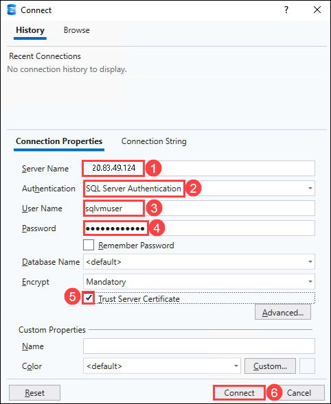
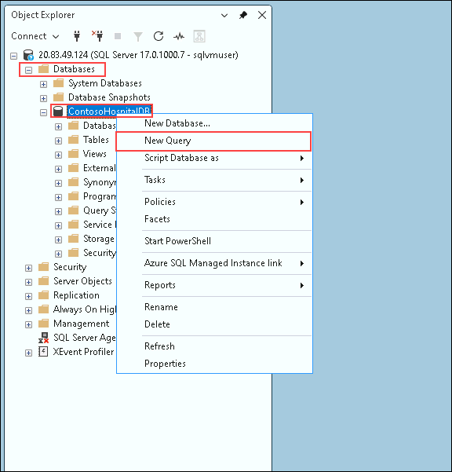
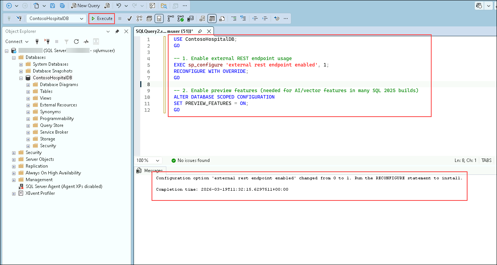
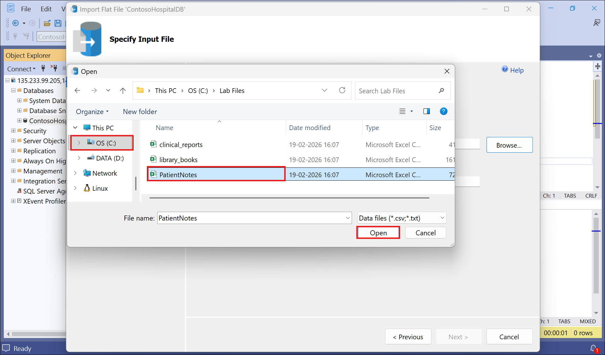
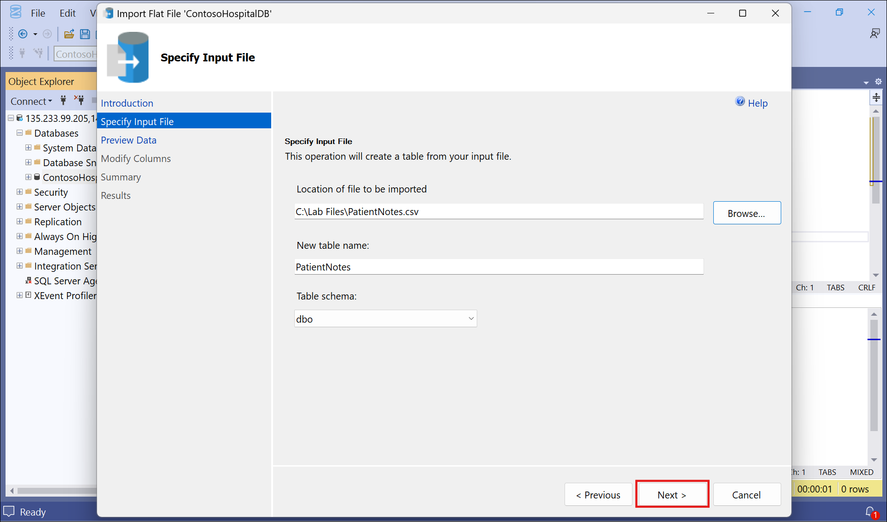
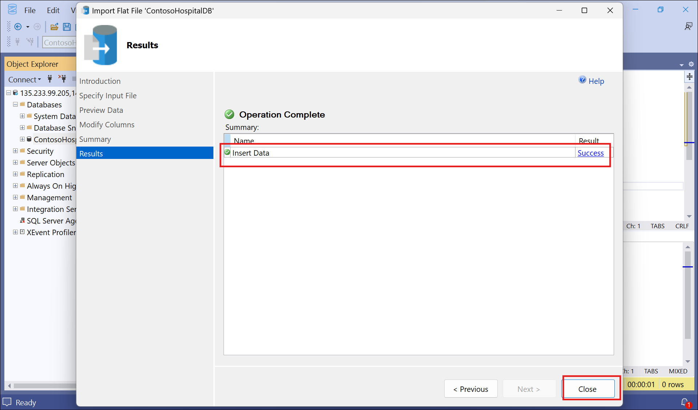
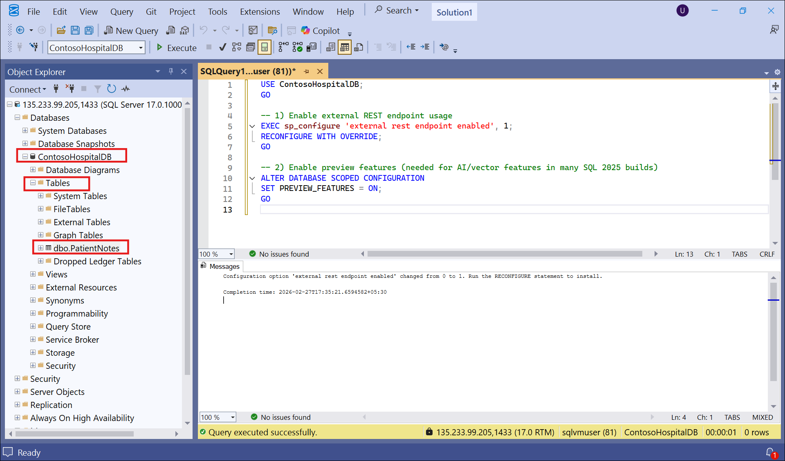
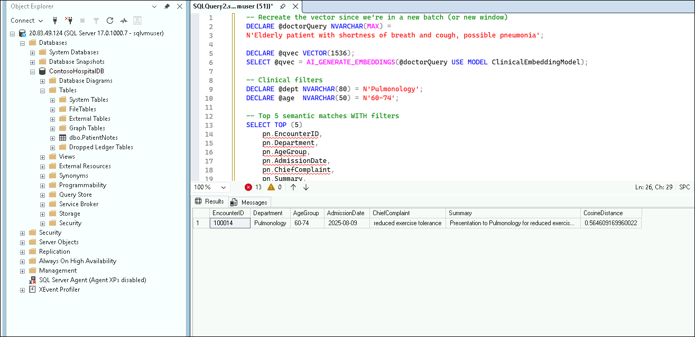
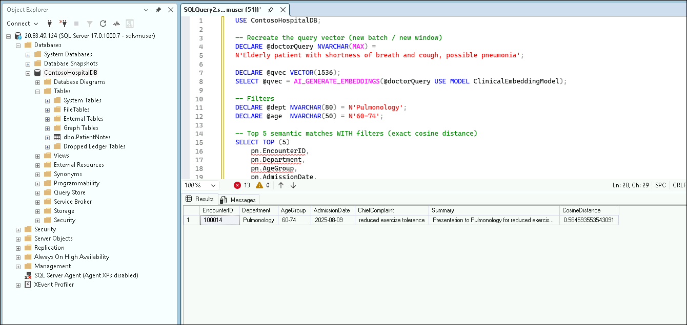

# Lab 1: Building a Semantic Patient Case Search Engine for Healthcare Using SQL Server 2025

In this lab, participants work with a realistic healthcare scenario at Contoso Medical College Hospital, where doctors need to quickly retrieve clinically similar patient cases using natural language queries. Instead of relying only on traditional keyword search, the hospital aims to implement a SQL-first semantic case retrieval system using SQL Server 2025 integrated with Azure OpenAI. By generating and storing vector embeddings directly inside the database, the solution enables intelligent, context-aware clinical search — transforming SQL Server into an AI-enabled healthcare data platform.

**Objectives**

- Provision and configure SQL Server 2025 on Azure VM

- Create and configure an Azure OpenAI embedding model

- Enable AI and vector capabilities inside SQL Server

- Generate and store vector embeddings for patient case summaries

- Implement semantic similarity search using VECTOR_DISTANCE

- Combine vector search with relational clinical filters

- Compare traditional keyword search with semantic search

## Exercise 1: Provision SQL Server on Azure VM
	
1. On your LabVM, click on the **Azure Portal** icon.

    

1. On the **Sign in to Microsoft Azure** tab, you will see the login screen. Enter the following email/username, and click on **Next (2)**. 

   - **Email/Username**: <inject key="AzureAdUserEmail"></inject> **(1)**
   
      
     
1. Now enter the following Temparory Access Pass and click on **Sign in (2)**.
   
   - **Temporaray Access Pass**: <inject key="AzureAdUserPassword"></inject> **(1)**

      
     
1. If you see the pop-up **Stay Signed in?**, select **No**.

   

1. In the Azure portal, type **Azure SQL (1)** in the top search bar and select **Azure SQL (2)** from the Services list.

    

1. In the Azure portal, expand **SQL Server (1)**, select **SQL Server on Azure VMs (2)**, and then click **+ Create (3)** to create a new **SQL Server Virtual Machine (4)**.

    

1. In the **Select an image offer** dropdown **(1)**, choose **Free SQL Server License: SQL Server 2025 Enterprise Developer on Windows Server 2025 (2)**.

    

1. After selecting the image offer **(3)**, click **Create virtual machine (4)** to proceed with the deployment.

    

1. On the **Basics** tab, provide the following details to configure the virtual machine:

    - **Subscription**: Select the available Azure subscription **(1)**
    - **Resource group**: Choose an existing resource group **AIDeveloper (2)**
    - **Virtual machine name**: Enter a name **sqlvm-<inject key="Deployment ID" enableCopy="false"/> (3)**
    - **Region**: Select **Central US (4)**
    - **Availability options**: Select **Availability zone (5)**
    - **Zone options**: Choose **Self-selected zone (6)**
    - **Availability zone**: Select **Zone 1 (7)**

      

1. Set the **Security type** to **Standard (1)**, ensure the correct **SQL Server 2025 Enterprise Developer image (2)** is selected, and then click **See all sizes (3)** to choose an appropriate VM size.

    

1. In the **Select a VM size** window, search for **E4ds_v5 (1)**, expand **E-Series v5 (2)**, select **E4ds_v5 (3)**, and then click **Select (4)**.

    

1. On the **Basics** tab, configure the following settings:

    - **Size**: Verify the selected size (**Standard_E4ds_v5 - 4 vCPUs, 32 GiB memory**) **(1)**
    - **Username**: Enter **sqlvmuser (2)**
    - **Password**: Enter **AZvmsql12345 (3)**
    - **Confirm password**: Enter **AZvmsql12345 (4)**
    - **Public inbound ports**: Select **Allow selected ports (5)**
    - **Select inbound ports**: Choose **RDP (3389) (6)**
    - Then, click **Next: Disk > (7)**.

      

1. Keep the default disk settings and click **Next: Networking >**.

    

1. Keep the default networking settings, ensure **Allow selected ports** with **RDP (3389)** is selected, and then click **Next: Management**.

    

1. On the **Management** tab, enable **System assigned managed identity (1)** and **Enable periodic assessment (2)**, then click **Next: Monitoring > (3)**.

    

1. Keep the default monitoring settings and click **Next: Advanced >**.

    

1. On the **SQL Server settings** tab, set **SQL connectivity** to **Public (Internet) (1)**, enable **SQL Authentication (2)**, and then click **Review + create (3)**.

    

1. Review the configuration details, ensure validation is passed, and then click **Create** to deploy the virtual machine.

    

1. Once the deployment is complete, click **Go to resource** to access the created virtual machine.

    

1. On the virtual machine **Overview** page, copy the **Public IP address** and paste in **Notepad** to use for connecting to the SSMS in the next steps.

    

## Exercise 2: Setup SQL Server 2025 environment 

>**Note:** You have SQL Server 2025 running and can connect with SSMS or
VS Code.

1. In the LabVM search bar, type **SSMS (1)** and select **SQL Server Management Studio 22 (2)** to open the application.

    

1. In the **Sign in to SQL Server Management Studio** window, click **Sign in with Microsoft** to continue.

    

1. Select **Work or school account (1)** and click **Continue (2)** to sign in using your assigned credentials.

    

1. In the **Connect** window, provide the following details to connect to the SQL Server:

    - **Server name**: Enter the **Public IP address (e.g., xx.xx.xx.xx)** of the SQL VM that you copied in **Exercise 1, Step 20** **(1)**
    - **Authentication**: Select **SQL Server Authentication (2)**
    - **User name**: Enter **sqlvmuser (2)**
    - **Password**: Enter the **AZvmsql12345 (3)**
    - **Trust Server Certificate**: Check this option **(4)**
    - Click **Connect (5)** to access the SQL Server.

      

## Exercise 3: Create Azure OpenAI resource and deploy Embedding Model 

1. In the Azure portal, type **Azure OpenAI (1)** in the top search bar and select **Azure OpenAI (2)** from the Services list.

    

1. In the **Azure OpenAI** page, click **+ Create (1)** and select **Azure OpenAI (2)** from the dropdown to create a new Azure OpenAI resource, which will be used to deploy models and generate embeddings in the lab.

    

1. On the **Basics** tab, provide the following details to create the Azure OpenAI resource for deploying models used in the lab:

    - **Subscription**: Select your Azure subscription **(1)**

    - **Resource group**: Choose an existing resource group **AIDeveloper (2)**

    - **Region**: Select **East US (3)**

    - **Name**: Enter **azsqlaoai-<inject key="Deployment ID" enableCopy="false"/> (4)**

    - **Pricing tier**: Select **Standard S0 (5)**

    - Click **Next (6)** to proceed.

      

1. On the **Review + submit** tab, verify the provided details and click **Create** to deploy the Azure OpenAI resource.

    

1. Once the deployment is complete, click **Go to resource** to open the Azure OpenAI resource.

    

1. In the Azure OpenAI resource, navigate to **Keys and Endpoint (1)** from the left navigation pane, copy the **Key1 (2)** and **Endpoint (3)** values and paste them in **Notepad** to use in the next steps for authentication and integration.

    

1. From the Azure OpenAI resource **Overview (1)** page, click **Go to Foundry portal (2)** to access model deployments and manage AI models required for the lab.

    

1. In the Foundry portal, navigate to **Deployments (1)**, click **+ Deploy model (2)**, and select **Deploy base model (3)** to deploy a model for use in the lab.

    

1. In the **Select a model** window, search for **text-embedding-3-small (1)**, select it **(2)**, and click **Confirm (3)** to use it for generating embeddings in the lab.

    

1. In the **Deploy text-embedding-3-small** window, click **Customize** to adjust limits.

    

1. In the **Deploy text-embedding-3-small** window, set the **Tokens per Minute Rate Limit** to **100K (1)**, keep the default settings, and click **Deploy (2)** to complete the model deployment.

    

1. After the model deployment is complete, navigate to **Deployments**, open the deployed model, and copy the **Endpoint (Target URI)** and paste it in the **Notepad** to use in the next steps for integration.

    

## Exercise 4: Create Data base and tables

1. Switch back to **SSMS**. Right click on the **Databases** folder and select New database
    to Get patient case data into SQL Server.

    

2. Enter the database name as **ContosoHospitalDB** and click OK.

    > Note: Another way to create the DB is by running the command: **CREATE DATABASE ContosoHospitalDB;**

    

## Exercise 5: Import PatientNotes.csv 

1. Expand the **Databases** folder, then right-click on **ContosoHospitalDB** and select **New Query**.

    

1. Execute the query to enable required SQL Server 2025 features

    ```
    USE ContosoHospitalDB;
    GO

    -- 1. Enable external REST endpoint usage
    EXEC sp_configure 'external rest endpoint enabled', 1;
    RECONFIGURE WITH OVERRIDE;
    GO

    -- 2. Enable preview features (needed for AI/vector features in many SQL 2025 builds)
    ALTER DATABASE SCOPED CONFIGURATION
    SET PREVIEW_FEATURES = ON;
    GO
    ```

    

1. Right-click Database → Tasks → Import Flat File as shown in the
    image below.

    

1. Click on **Next** on the Introduction page.

    

1. **Browse** the file on the Specify Input file section.

    

1. Select **PatientNotes.csv** file from C:\Labfiles folder.

    

1. Click on **Next** to proceed.

    

1. Preview the data and click on **Next**.

    

1. Keep the columns as is and click on **Next**.

    

1. **Finish** the process.

    

1. Once the operation is completed, close the window.

    

1. Expand the tables section under the database and notice that the
    table is created.

    

## Exercise 6: Create external embedding model

1. Run below query to Create master key (needed once per DB)
    
    ```
    USE ContosoHospitalDB;
    GO
    IF NOT EXISTS(SELECT * FROM sys.symmetric_keys WHERE name = '##MS_DatabaseMasterKey##')
    BEGIN
        CREATE MASTER KEY ENCRYPTION BY PASSWORD = N'ContosoSQLAI@2025!';
    END;
    GO
    ```

    

1. Run below query to Create database scoped credential. The credential
    name must match the URL you reference in the external model and place your **Azure OpenAI Endpoint Key** and **<YOUR_AZURE_OpenAI_KEY>**.

    ```
    USE ContosoHospitalDB;
    GO
    IF EXISTS (SELECT 1 FROM sys.database_scoped_credentials WHERE name = N'https://<resource>.OpenAI.azure.com/')
    BEGIN
        DROP DATABASE SCOPED CREDENTIAL [https://<resource>.OpenAI.azure.com/];
    END
    GO

    CREATE DATABASE SCOPED CREDENTIAL [https://<resource>.OpenAI.azure.com/]
    WITH
        IDENTITY = 'HTTPEndpointHeaders',
        SECRET = '{"api-key":"<YOUR_AZURE_OpenAI_KEY>"}'
    GO
    ```

    

1. Switch back to Foundry portal and copy the model endpoint value:

    

1. Update below query with Azure OpenAI end point and Embeddigns model
    location (Foundry portal) and run to create external model

    ```
    USE ContosoHospitalDB;
    GO

    IF EXISTS (SELECT 1 FROM sys.external_models WHERE name = 'ClinicalEmbeddingModel')
        DROP EXTERNAL MODEL ClinicalEmbeddingModel;
    GO

    CREATE EXTERNAL MODEL ClinicalEmbeddingModel
    WITH
    (
    LOCATION   = 'https://<resource>.OpenAI.azure.com/OpenAI/deployments/<embedding-deployment>/embeddings?api-version=2024-02-01',
    API_FORMAT = 'Azure OpenAI',
    MODEL_TYPE = EMBEDDINGS,
    MODEL      = 'text-embedding-3-small',
    CREDENTIAL = [https://<resource>.OpenAI.azure.com/],
    PARAMETERS = '{ "sql_rest_options": { "retry_count": 10 } }'
    );
    GO
    ```

    

## Exercise 7: Generate embeddings and store vectors

1. Run below command to create embeddings table (VECTOR column)

    ```
    USE ContosoHospitalDB;
    GO

    DROP TABLE IF EXISTS dbo.PatientEmbeddings;
    GO

    CREATE TABLE dbo.PatientEmbeddings
    (
        EncounterID INT NOT NULL PRIMARY KEY,
        Embedding   VECTOR(1536) NOT NULL
    );
    GO
    ```

    

1. Run below query to populate embeddings

    ```
    USE ContosoHospitalDB;
    GO

    INSERT INTO dbo.PatientEmbeddings (EncounterID, Embedding)
    SELECT
        pn.EncounterID,
        AI_GENERATE_EMBEDDINGS(pn.Summary USE MODEL ClinicalEmbeddingModel)
    FROM dbo.PatientNotes pn
    WHERE pn.Summary IS NOT NULL;
    GO
    ```

    

1. Run below query to validate embeddings:
    ```
    SELECT COUNT(*) AS TotalEmbeddings FROM dbo.PatientEmbeddings;
    SELECT * FROM dbo.PatientEmbeddings;
    ```
    

    

1. Run below query to create vector index (DiskANN)

    ```
    USE ContosoHospitalDB;
    GO

    CREATE VECTOR INDEX IX_PatientEmbeddings
    ON dbo.PatientEmbeddings (Embedding)
    WITH (METRIC = 'cosine', TYPE = 'diskann');
    GO
    ```

    

## Exercise 8: Semantic case retrieval (doctor symptom query)

This exercise helps you search for patient cases that are **similar in
meaning** to a doctor's query, using vector embeddings.

1. Run below query for exact semantic search (VECTOR_DISTANCE). No
    manual embedding, No REST API, No 1536‑value array and SQL Server
    does everything automatically

    ```
    USE ContosoHospitalDB;
    -- (No GO here if you intend to keep @qvec in the same batch)

    -- 1. Doctor's natural-language query
    DECLARE @doctorQuery NVARCHAR(MAX) =
    N'Elderly patient with shortness of breath and cough, possible pneumonia';

    -- 2. Generate a 1536-dim embedding vector from the model
    DECLARE @qvec VECTOR(1536);
    SELECT @qvec = AI_GENERATE_EMBEDDINGS(@doctorQuery USE MODEL ClinicalEmbeddingModel);

    -- 3. (Optional) Unfiltered Top 5 semantic matches
    SELECT TOP (5)
        pn.EncounterID,
        pn.Department,
        pn.AgeGroup,
        pn.AdmissionDate,
        pn.ChiefComplaint,
        pn.Summary,
        VECTOR_DISTANCE('cosine', @qvec, pe.Embedding) AS CosineDistance
    FROM dbo.PatientEmbeddings AS pe
    JOIN dbo.PatientNotes       AS pn
    ON pn.EncounterID = pe.EncounterID
    ORDER BY CosineDistance ASC;
    ```

    

1. Run semantic search with clinical filters.this query filters
    Department = Pulmonology and Age group = 60–74

    ```
    -- Recreate the vector since we’re in a new batch (or new window)
    DECLARE @doctorQuery NVARCHAR(MAX) =
    N'Elderly patient with shortness of breath and cough, possible pneumonia';

    DECLARE @qvec VECTOR(1536);
    SELECT @qvec = AI_GENERATE_EMBEDDINGS(@doctorQuery USE MODEL ClinicalEmbeddingModel);

    -- Clinical filters
    DECLARE @dept NVARCHAR(80) = N'Pulmonology';
    DECLARE @age  NVARCHAR(50) = N'60-74';

    -- Top 5 semantic matches WITH filters
    SELECT TOP (5)
        pn.EncounterID,
        pn.Department,
        pn.AgeGroup,
        pn.AdmissionDate,
        pn.ChiefComplaint,
        pn.Summary,
        VECTOR_DISTANCE('cosine', @qvec, pe.Embedding) AS CosineDistance
    FROM dbo.PatientEmbeddings AS pe
    JOIN dbo.PatientNotes       AS pn
    ON pn.EncounterID = pe.EncounterID
    WHERE (@dept IS NULL OR pn.Department = @dept)
    AND (@age  IS NULL OR pn.AgeGroup   = @age)
    ORDER BY CosineDistance ASC;
    ```

    

1. I’ve kept your parameters and added in‑proc embedding generation.
    This SP uses exact cosine; you can add an @useAnn BIT = 0 switch
    later if you want to go the ANN→re‑rank route.

    ```
    USE ContosoHospitalDB;
    GO

    CREATE OR ALTER PROCEDURE dbo.FindSimilarPatientCases
        @doctorQuery   NVARCHAR(MAX),
        @topK          INT = 5,
        @department    NVARCHAR(80) = NULL,
        @ageGroup      NVARCHAR(50) = NULL
    AS
    BEGIN
        SET NOCOUNT ON;

        -- Create the query vector each time (proc scope)
        DECLARE @qvec VECTOR(1536);
        SELECT @qvec = AI_GENERATE_EMBEDDINGS(@doctorQuery USE MODEL ClinicalEmbeddingModel);

        SELECT TOP (@topK)
            pn.EncounterID,
            pn.Department,
            pn.AgeGroup,
            pn.AdmissionDate,
            pn.ChiefComplaint,
            pn.DiagnosisKeywords,
            pn.Summary,
            VECTOR_DISTANCE('cosine', @qvec, pe.Embedding) AS CosineDistance
        FROM dbo.PatientEmbeddings AS pe
        JOIN dbo.PatientNotes       AS pn
        ON pn.EncounterID = pe.EncounterID
        WHERE (@department IS NULL OR pn.Department = @department)
        AND (@ageGroup   IS NULL OR pn.AgeGroup   = @ageGroup)
        ORDER BY CosineDistance ASC;
    END
    GO

    ```
    

1. Run below query to test:

    ```
    -- test 1
    EXEC dbo.FindSimilarPatientCases
    @doctorQuery = N'child with wheezing and nighttime cough, asthma flare',
    @topK = 5,
    @department = N'Pediatrics';

    -- test 2 (unfiltered)
    EXEC dbo.FindSimilarPatientCases
    @doctorQuery = N'shortness of breath and fever, rule out pneumonia',
    @topK = 5;
    ```

    

## Exercise 9: Compare keyword vs semantic search

1. Run below queries and the count should match

    ```
    SELECT COUNT(*) FROM dbo.PatientNotes;
    SELECT COUNT(*) FROM dbo.PatientEmbeddings;
    ```

    

1. Run below query to test embedding generation:

    ```
    SELECT AI_GENERATE_EMBEDDINGS(N'test case' USE MODEL ClinicalEmbeddingModel);
    ```

    

1. Run below query -Find similar cases for fever + painful urination
    and filter to Infectious Disease

    ```
    EXEC dbo.FindSimilarPatientCases
    @doctorQuery = N'fever and painful urination, possible UTI',
    @topK = 5,
    @department = N'Infectious Disease';
    ```
    

1. Run below query with and without department filter. Observe:Mix of
    departments,Cardiology,Emergency,Internal Medicine.

    ```
    EXEC dbo.FindSimilarPatientCases
    @doctorQuery = N'Chest pain on exertion',
    @topK = 5;
    ```

    

1. Run below query With Filter (Cardiology Only). Observe: Only cardiology cases ,Possibly fewer results,Ranking slightly changes

    ```
    EXEC dbo.FindSimilarPatientCases
    @doctorQuery = N'chest pain on exertion',
    @topK = 5,
    @department = N'Cardiology';
    ```

    

1. Run below query with Hybrid search pattern

    ```
    EXEC dbo.FindSimilarPatientCases
    @doctorQuery = N'shortness of breath',
    @topK = 5;
    ```

    

    ```
    EXEC dbo.FindSimilarPatientCases
    @doctorQuery = N'dyspnea',
    @topK = 5;
    ```

    

1. Close **SSMS** and exit without saving any changes.

## Conclusion:

This lab demonstrates how SQL Server 2025 evolves beyond a traditional relational database into an AI-powered data platform. By integrating Azure OpenAI embeddings directly within SQL, participants build a semantic case retrieval agent that allows doctors to search patient cases using natural language. Through vector indexing, cosine similarity search, and hybrid filtering, learners gain hands-on experience in implementing real-world AI-driven clinical search solutions inside the database engine.


