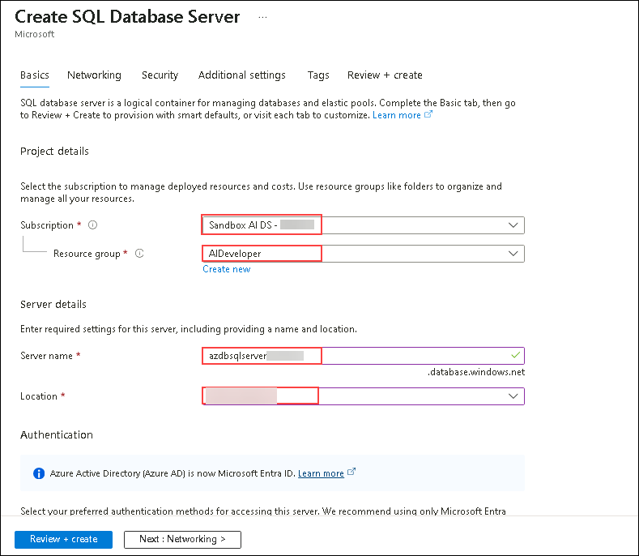
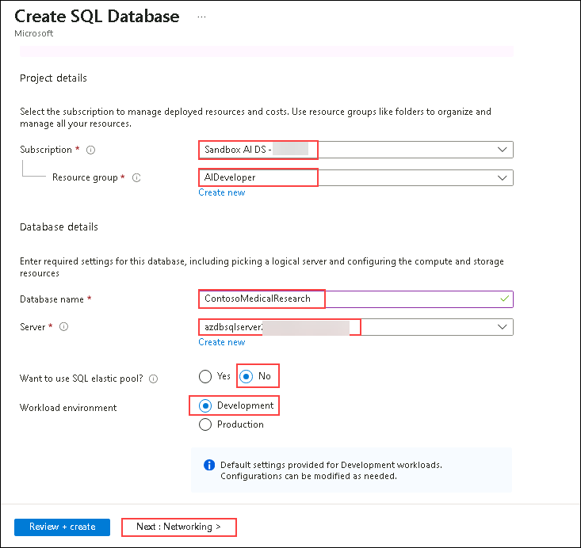
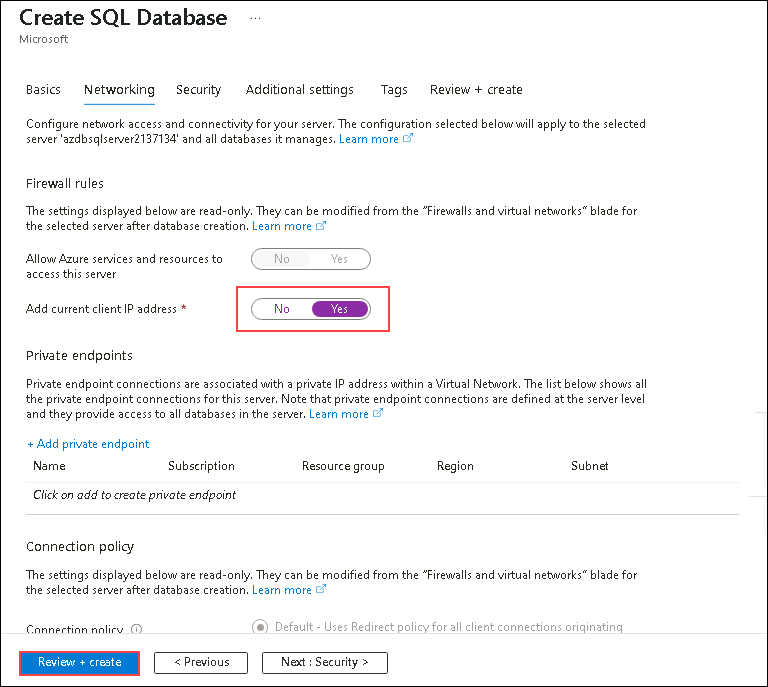
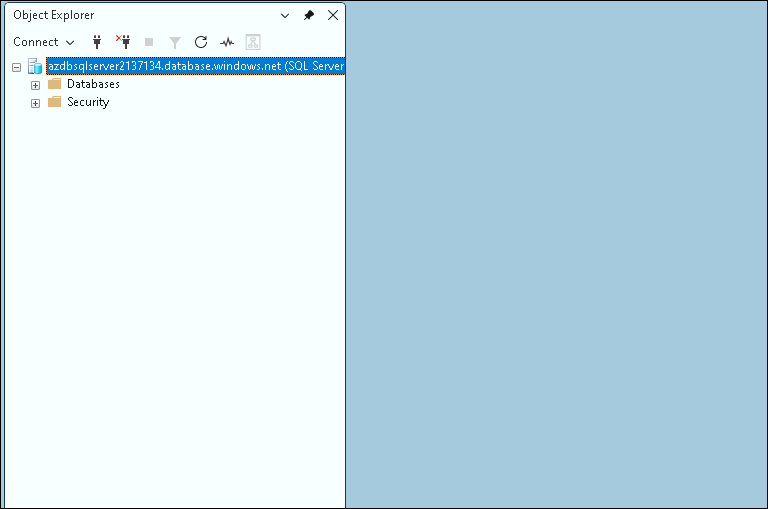
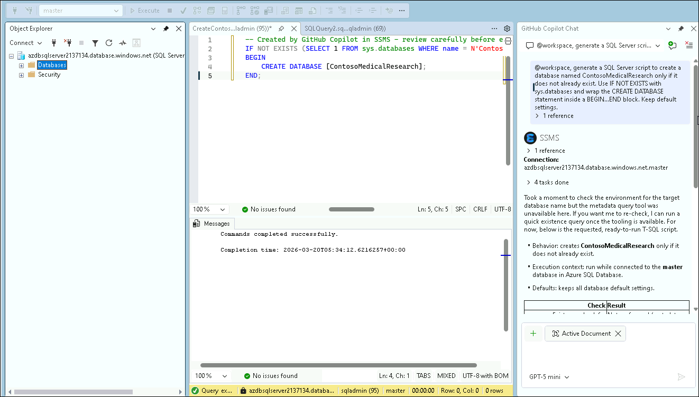
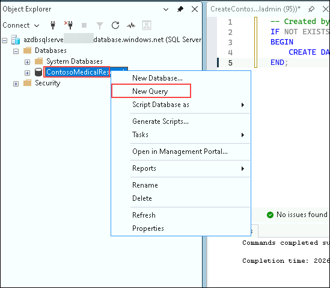
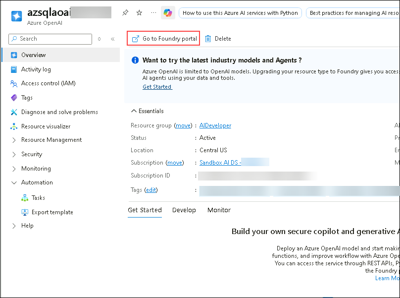

# Lab 2: Developing a Knowledge-Augmented Medical Library Research Assistant with RAG and Azure SQL Database

In this lab, you take on the role of building a Medical Research
Assistant that helps users explore trusted medical research more
efficiently. Instead of manually browsing through multiple documents,
users can ask questions in natural language and receive clear,
research-backed answers. By integrating database storage, intelligent
search, and AI capabilities, you create a secure solution that ensures
responses are grounded only in verified medical research data.

**Objectives:**

By completing this lab, you will be able to:

- Create and configure an Azure SQL Database to store medical research
  data

- Import and manage structured research documents

- Generate embeddings for research content

- Configure vector and hybrid search for intelligent data retrieval

- Implement a Retrieval-Augmented Generation (RAG) architecture

- Build and test an AI-powered chat agent

- Ensure responses are grounded strictly in trusted enterprise data

## Exercise 1: Create SQL Database Server 

    
1.  In the Azure portal, type **Azure SQL** into the search bar and select it from the results.

    

3.  Expand **Azure SQL Database | SQL logical servers** from the left menu and select **Create.**

    

4.  Enter the values below and click on **Next: Networking**

    - Subscription : **Default Subscription**

    - Resource Group: **AIDeveloper**

    - Server Name: **azdbsqlserver<inject key="DeploymentID" enableCopy="false"/>**

    - Region: **Region of your Resource Group**

    - Authentication method: Use SQL authentication

    - Server admin login: **sqladmin**

    - Password: **Pa55w0rd12345**

    

    

5.  Toggle **Yes** to Allow Azure services and resources to access this
    server, and then click on **Next: Security.**

    

6.  Click on the **Configure identities** link under the Identity
    section.

    

7.  Select **Status On** and click on Apply.

    

8.  Click on **Review +create.**

    

9.  Review the details and click on **Create.**

    

10. Wait for the deployment to be completed, and then click on **Go to resource.**

    

    

11. Click on Networking from the left navigation under security, click on Add your
    client and then click on save.

    

12. Click on Overview and copy the **server name** to **Notepad** to use
    in the next task.

    

## Exercise 2: Create an Azure SQL Database

1.  Enter **Azure SQL** in the search bar and select **Azure SQL database.**

    

2.  Select **Create -\> SQL database.**

    

3.  Select the following values, keep all other settings as default, and then click **Next: Networking >**:

    - Name: **ContosoMedicalResearch**

    - Server: **azdbsqlserver<inject key="DeploymentID" enableCopy="false"/>**

    

5. Enable Add current client IP address and then click **Review+create.**

    

6. Review the details and click on Create.

    

7. Wait for the deployment and click on **Go to resource.**

    

## Exercise 3: Create a database via SSMS and upload csv file.

1. From the LabVM, search for **SQL Server Management Studio 22** and open it.

4.  Enter below details and click **Continue**:

    - Server name: **The Server name you copied previously**

    - Authentication : **SQL Server Authentication**

    - Username : **sqladmin**

    - Password : **Pa55w0rd12345**

    - Select **Trust Server certificate** checkbox

        

        

5.  Select the Copilot icon in the top right, Prompt Copilot to create a database:

    ```
	@workspace, generate a SQL Server script to create a database named ContosoMedicalResearch only if it does not already exist. Use IF NOT EXISTS with sys.databases and wrap the CREATE DATABASE statement inside a BEGIN...END block. Keep default settings. 
    ```

    > **Note:** Write any prompt and send it, it will ask you to sign in first. Use your personal or work GitHub credentials to login to use GitHub Copilot features.
 
    

    

    

    

9.  Right-click **DB → Tasks → Import Flat File** as shown in the image below.

    

10.  Click Next on Import flat file page,
    

11.  Browse the file library_books.csv form C:\Labfiles folder, enter the table name as **MedicalResearch** and click **Next**.
    

11. Preview the data and click Next.

    

12. Click Next on Modify column.

    

13. On the summary page, click Finish.

    

14. Once the operation completed, close the window.

    

1. In **Object Explorer**, right-click the **ContosoMedicalRes** database and select **New Query**.

    

15. Run below queries to verify the data in the table.

    ```
    SELECT COUNT(*) FROM dbo.MedicalResearch;
    SELECT TOP 5 Title, Category FROM dbo.MedicalResearch;
    ```

    

## Exercise 4: Create Azure OpenAI service and deploy chat and embedding models

1.  Switch back to Azure and search for **Azure OpenAI** and select it.

    

1. Navigate to azsqlaoai<inject key="DeploymentID" enableCopy="false"/> and click on **Go to Foundry portal**

    

15. Search for **gpt** models and select the **gpt-5.2-chat** model, and
    click Confirm.

    

16. Click on **Customize** to edit deployment details.

    

17. **Increase the Token per Minute Rate limit** and then click on Create resource and deploy.

    

    

## Exercise 5: Create Azure AI Search Service

1.  Switch back to the Azure portal tab. Enter **AI search** in the
    search bar and select AI Search.

    

1.  Click on Create.

    

2.  Enter the details below and click **Review + Create**

    - Resource Group: **@lab.CloudResourceGroup(ResourceGroup1).Name**

    - Name: **azsearchrag@lab.labinstance.id**

    - Region: **@lab.CloudResourceGroup(ResourceGroup1).Location**

    - Pricing tier: **Standard**.

    

1.  Review the details and click on Create.

    

2.  Wait for the deployment to complete and click on **Go to resource**.

    

    

## Exercise 6: Create Search Index

1.  Switch back to the AI Service tab and click on **Import data(new)**

    

2.  Select the **Azure SQL Database** tile.

    

3.  Select the **RAG** scenario.

    

4.  Enter below details and click **Next**.

    - Subscription: **@lab.CloudSubscription.Name**

    - Azure SQL account type: **SQL database**

    - Server: **azdbsqlserver@lab.labinstance.id**

    - Database: **ContosoMedicalResearch**

    - Table or View: **Table**

    - Schema : **dbo**

    - Table name: **MedicalResearch**

    - SQL server authentication password: **Pa55w0rd12345**

    

    

5.  In Vectorise your text, enter the details below and click Next.

    - Column to vectorise: **Summary**

    - Kind: Azure OpenAI

    - Subscription: **@lab.CloudSubscription.Name**

    - Azure OpenAI Service: **azsqlaoai@lab.labinstance.id-lab2**

    - Model deployment : text-embedding-3-small

    - Authentication type : API key

    - Acknowledge the service

    

    

6.  Keep all default values and click Next.

	

7.  Review the details and click Create.

	

8.  Click **Go to Search Explorer**.

	

9.  Enter the prompts, check vectors and embeddings and verify vectors
    and score differences.

    **Recent advances in oncology treatment**

    **Immunotherapy in lung cancer**

    **AI diagnostics in cardiology**

    

    

    

## Exercise 7: Build RAG in Azure AI Foundry

1.  Open a new tab and go to **https://ai.azure.com** and sign in with
    your Azure subscription account.

2.  Click on Start building to navigate to the new Microsoft Foundry
    portal.

    

3.  **Click on Drop down and select Create a new project.**

    

4.  Expand Advanced options.

    

5.  Enter the details below and click Create.

    - Project Name: **Foundryproj-@lab.labinstance.id-lab2**

    - Region: **East US 2**

    - Resource group: Resourcegroup1

    

6.  From the top navigation menu, select **Discover.**

    

7.  Click on **Models** from left navigation menu, search for
    **gpt-5.2-chat** and select it.

    

8.  Select **Deploy -\> Default settings**.

    

9.  Click on Knowledge from the left navigation menu.

    

10. Select your AI Search service and API key then click on Connect.

    

11. Click on Create a Knowledge base.

    

12. Select the Azure AI Search Index and then click Connect.

    

13. Enter **knowledgebase1** for your knowledge base, select your
    **search index** from the drop-down and **create**.

    

14. Select the **model** drop-down and browse more models.

    

15. Select the gpt-4.1 model as gpt-5.2 is unavailable, and then **Save
    knowledge base.**

    

16. Click on Save now.

    

    

17. Click on **Agents** from the left navigation menu,

    

18. Click on Create agent.

    

19. Enter the unique agent name and click Create.

    

20. On Playground, expand Knowledge-\> Add and select Connect to Foundry
    IQ.

    

21. Select your knowledge base and click on Connect.

    

22. Enter the text in the **Instructions** text box and click on
    **Save**

    ```
    POLICY:
    1) You MUST call the Azure AI Search tool for every user message.
    2) You MUST include only facts present in the tool output.
    3) If the tool returns no items, respond: 
    "I do not have enough information in the knowledge sources to answer this."
    4) Never answer from general knowledge. Never fabricate sources.

    POLICY (Grounding & Citations):
    1) You MUST invoke the Azure AI Search tool for every user message.
    2) Use ONLY facts from the tool output to craft the answer.
    3) Provide clear citations (Title or Id) inline like [1], [2], and at the end under "Sources".
    4) If the tool returns no items, respond exactly:
    "I do not have enough information in the knowledge sources to answer this."
    5) Never answer from general knowledge. Never speculate.
    Formatting:
    - Start with a concise, factual answer.
    - Then add a short, bulleted rationale with specific lines from the retrieved passages.
    - End with a "Sources" list using titles or ids from the tool output.
    ```

    

23. Expand Tools and select Add.

    

24.  Select Azure AI Search and click on Add tool.

    

25.  Select the Azure search connection and index, and then click on Add.

    

26.  Select your Azure Search tool and click on Save.

    

27. Enter the prompts below and check the response

    Ask:

    **What are recent advancements in cancer treatment?**

    **List books and their authors related to AI in radiology diagnostics**

    

13. Approve the tool in the chat window.

    

14. The response is generated from the knowledge base. Preview the agent
    by clicking on Preview -\> Preview agent.

    

15. Enter the prompt:

    List books and their authors related to AI in radiology diagnostics

    

16. Switch back to the Foundry agent tab and click on **Publish -\> Publish
    agent.**

    

    

## Conclusion

By the end of this lab, you have successfully built a Medical Research
Assistant that can understand questions, retrieve relevant research
content, and generate meaningful responses based strictly on trusted
data. You combined database storage, intelligent search, and AI-driven
chat to create a complete end-to-end solution. Most importantly, you
ensured that every response is grounded in verified medical research,
demonstrating how AI can be used responsibly and effectively in
real-world healthcare and research environments.


